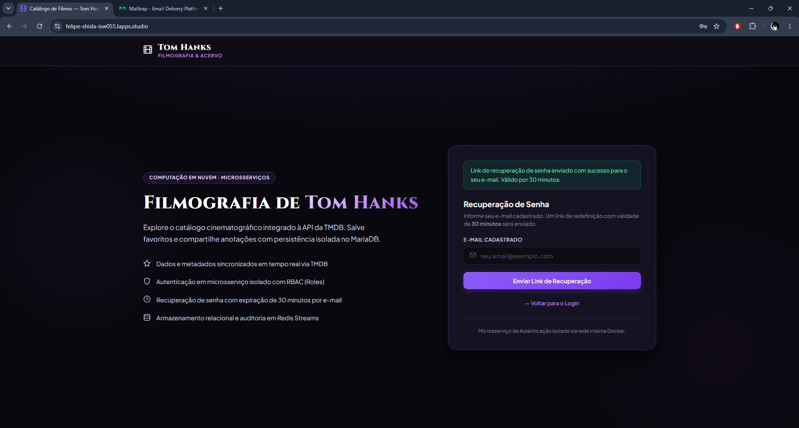
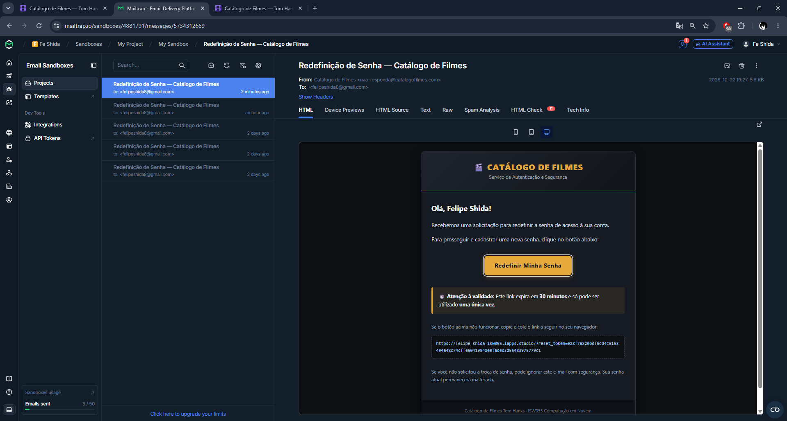
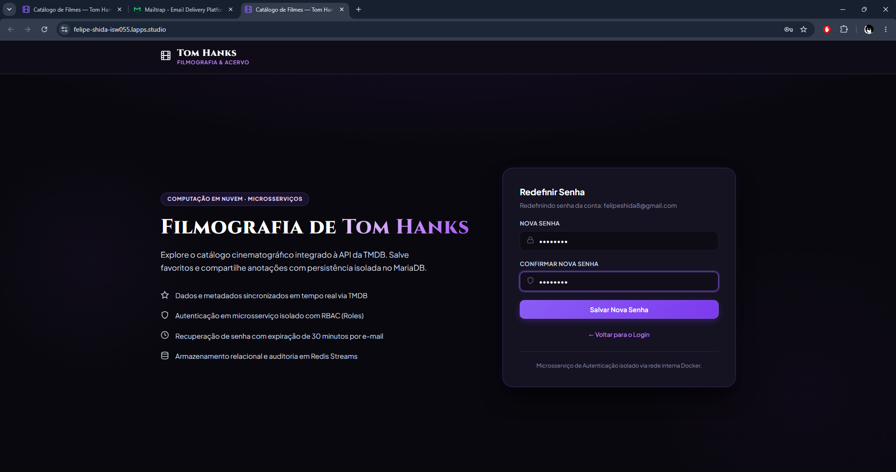
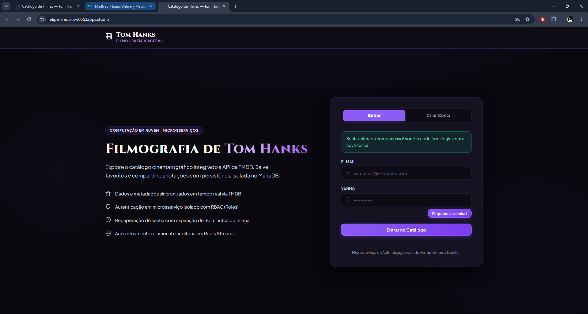
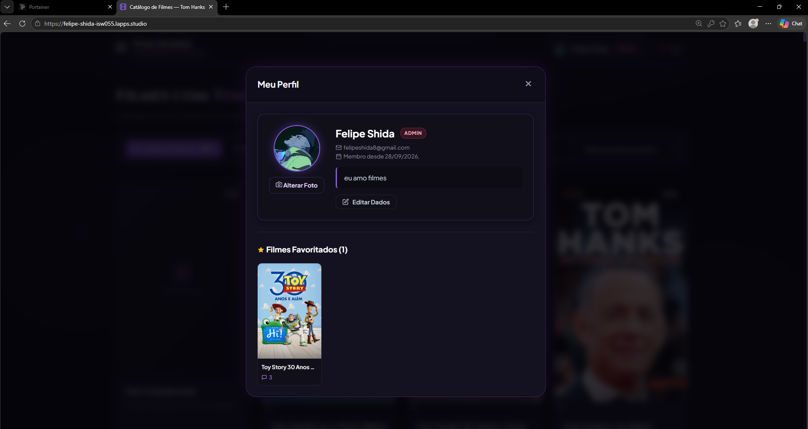

# 🎬 Catálogo de Filmes, Microsserviço de Autenticação & Auditoria (Redis Streams) — Tom Hanks

> Atividade Prática da disciplina **ISW055 - Introdução à Computação em Nuvem**  
> Professor: **Allan Siriani** ([@siriani](https://github.com/siriani))

---

## 📌 Sobre o Projeto

Aplicação web estruturada em **Arquitetura de Microsserviços** para exibição e gerenciamento da filmografia do ator **Tom Hanks**, integrando consumo de dados em tempo real da **TMDB (The Movie Database)**, persistência no **MariaDB** com segregação por usuário, um **serviço isolado de autenticação** com gerenciamento de papéis (*roles*), recuperação de senhas por e-mail com expiração real, e um **serviço isolado de logs e auditoria (`log-service`)** com persistência em **Redis Streams** (`audit:events`) operando estritamente na rede interna do Docker.

---

## 🏛️ Arquitetura de Microsserviços

O sistema é dividido em containers de microsserviços orquestrados via **Docker Compose**, operando em rede isolada:

```
                                  [ Navegador / Usuário ]
                                             │
                                   (HTTPS / Porta Pública)
                                             │
                                             ▼
                                  ┌─────────────────────┐
                                  │   CATÁLOGO (App)    │ ◄─── Ponto de Entrada Público (:3000)
                                  └────┬───────────┬────┘
                                       │           │
                 ┌─────────────────────┘           └─────────────────────┐
                 │ (Rede Interna Docker)                                 │ (Rede Interna Docker)
                 │ (http://auth-service:4000)                            │ (http://log-service:5000)
                 ▼                                                       ▼
      ┌─────────────────────┐         ┌───────────────────────┐ ┌─────────────────────┐
      │    AUTH-SERVICE     ├────────►│     SMTP Externo      │ │     LOG-SERVICE     │
      │  (Sem porta host)   │         │ (Mailtrap / Brevo)    │ │  (Sem porta host)   │
      │ Login, Role, Reset  │         │ E-mail de Recuperação │ │ Auditoria de Eventos│
      └──────────┬──────────┘         └───────────────────────┘ └──────────┬──────────┘
                 │                                                         │
                 │ (Disparo de login/logout)                               │ (XADD / XRANGE)
                 └─────────────────────────┬───────────────────────────────┘
                                           │
                        ┌──────────────────┴──────────────────┐
                        │                                     │
                        ▼                                     ▼
             ┌─────────────────────┐               ┌─────────────────────┐
             │       MariaDB       │               │        REDIS        │
             │   (Dados Relacionais│               │   (Redis Streams)   │
             │ usuários, favoritos,│               │    audit:events     │
             │     comentários)    │               │  Histórico Temporal │
             └─────────────────────┘               └─────────────────────┘
```

### 1. Catálogo de Filmes (`catalog`)
- **Único ponto de entrada público**: expõe a porta `3000` (ou porta do aluno).
- Serve os arquivos estáticos do frontend (HTML/CSS/JS).
- Comunica-se com a API externa da **TMDB** para buscar a filmografia e detalhes dos filmes.
- Persiste favoritos isolados por usuário e gerencia comentários da comunidade no MariaDB.
- Repassa chamadas de autenticação ao `auth-service` e dispara eventos de auditoria ao `log-service`.
- Disponibiliza a rota de consulta de auditoria (`GET /api/logs`), protegida exclusivamente para administradores via RBAC.

### 2. Microsserviço de Autenticação (`auth-service`)
- **Sem porta pública no host**: totalmente invisível para a internet externa, acessível apenas via rede interna do Docker (`http://auth-service:4000`).
- Responsabilidade única de:
  - Cadastro de usuários e login com hash **bcrypt**.
  - Emissão e validação de tokens **JWT**.
  - Gestão de papéis de acesso (**Roles**: `usuario` e `admin`).
  - Geração de tokens de recuperação de senha com **expiração real de 30 minutos** e controle de uso único.
  - Envio real de e-mails transacionais via SMTP (**Mailtrap** em dev / **Brevo** em prod).
  - Disparo de eventos de auditoria (`login`, `logout`, tentativas de acesso negado) para o `log-service`.

### 3. Microsserviço de Logs e Auditoria (`log-service`)
- **Sem porta pública no host**: comunicação restrita à rede interna do Docker (`http://log-service:5000`).
- Grava eventos comportamentais em tempo real no **Redis Streams** (`audit:events`) usando `XADD`.
- Oferece rota de consulta protegida (`GET /api/logs`) com suporte a `XREVRANGE` e `XRANGE`.

### 4. Redis (`redis`)
- Persistência em memória com durabilidade AOF (`appendonly yes`).
- Armazena a stream `audit:events` com ordenação cronológica e IDs monotônicos nativos.

### 5. MinIO (`minio`) - Object Storage
- Armazenamento de alta performance para arquivos binários, 100% compatível com a API AWS S3.
- Isolamento absoluto de imagens fora do banco relacional MariaDB.
- Bucket dedicado (`perfil-usuarios`) com política de leitura pública para entrega direta e cacheável de fotos de perfil.
- Portas expostas: `9000` (API S3) e `9001` (Console Web administrativo).

---

## 🗄️ Modelo do Banco de Dados (MariaDB)

As tabelas são gerenciadas e criadas automaticamente pelos serviços:

```sql
-- Gerenciadas pelo Auth-Service / Catálogo:
CREATE TABLE IF NOT EXISTS usuarios (
  id INT AUTO_INCREMENT PRIMARY KEY,
  nome VARCHAR(100) NOT NULL,
  email VARCHAR(150) UNIQUE NOT NULL,
  senha_hash VARCHAR(255) NOT NULL,
  role VARCHAR(20) NOT NULL DEFAULT 'usuario',
  bio VARCHAR(500) DEFAULT '',
  foto_perfil VARCHAR(255) DEFAULT NULL,
  criado_em TIMESTAMP DEFAULT CURRENT_TIMESTAMP
) ENGINE=InnoDB DEFAULT CHARSET=utf8mb4;

CREATE TABLE IF NOT EXISTS reset_tokens (
  id INT AUTO_INCREMENT PRIMARY KEY,
  token VARCHAR(255) UNIQUE NOT NULL,
  usuario_id INT NOT NULL,
  criado_em TIMESTAMP DEFAULT CURRENT_TIMESTAMP,
  expira_em DATETIME NOT NULL,
  usado BOOLEAN DEFAULT FALSE,
  FOREIGN KEY (usuario_id) REFERENCES usuarios(id) ON DELETE CASCADE
) ENGINE=InnoDB DEFAULT CHARSET=utf8mb4;

-- Gerenciadas pelo Catálogo:
CREATE TABLE IF NOT EXISTS favoritos (
  id INT AUTO_INCREMENT PRIMARY KEY,
  usuario_id INT NOT NULL,
  tmdb_movie_id INT NOT NULL,
  titulo VARCHAR(255) NOT NULL,
  poster_path VARCHAR(255),
  criado_em TIMESTAMP DEFAULT CURRENT_TIMESTAMP,
  FOREIGN KEY (usuario_id) REFERENCES usuarios(id) ON DELETE CASCADE,
  UNIQUE KEY uq_usuario_filme (usuario_id, tmdb_movie_id)
) ENGINE=InnoDB DEFAULT CHARSET=utf8mb4;

CREATE TABLE IF NOT EXISTS comentarios (
  id INT AUTO_INCREMENT PRIMARY KEY,
  usuario_id INT NOT NULL,
  tmdb_movie_id INT NOT NULL,
  texto TEXT NOT NULL,
  criado_em TIMESTAMP DEFAULT CURRENT_TIMESTAMP,
  FOREIGN KEY (usuario_id) REFERENCES usuarios(id) ON DELETE CASCADE
) ENGINE=InnoDB DEFAULT CHARSET=utf8mb4;
```

---

## 🔑 Fluxo de Recuperação de Senha ("Esqueci Minha Senha") & Evidências

O sistema conta com um ciclo de vida robusto e seguro para recuperação de credenciais, implementado no microsserviço isolado de autenticação (`auth-service`) com envio real de e-mails transacionais via SMTP (Mailtrap em homologação e Brevo em produção), garantindo proteção contra ataques de repetição (*replay attacks*) e sequestro de sessão.

### 📐 Diagrama de Sequência do Fluxo

```
[ Usuário / Browser ]        [ Catálogo (:3000) ]        [ Auth-Service (:4000) ]        [ MariaDB ]         [ SMTP (Mailtrap) ]
        │                             │                             │                         │                       │
        │ 1. Informa e-mail           │                             │                         │                       │
        ├────────────────────────────►│ 2. POST /forgot-password    │                         │                       │
        │                             ├────────────────────────────►│ 3. Gera token 32 bytes   │                       │
        │                             │                             ├────────────────────────►│                       │
        │                             │                             │    Salva token com      │                       │
        │                             │                             │    expira_em = NOW()+30m│                       │
        │                             │                             │    e usado = FALSE      │                       │
        │                             │                             │                         │ 4. Envia e-mail       │
        │                             │                             ├────────────────────────────────────────────────►│
        │                             │◄────────────────────────────┤                         │                       │
        │◄────────────────────────────┤ 5. Resposta: E-mail enviado │                         │                       │
        │                             │                             │                         │                       │
        │ 6. Abre e-mail e clica no link (?reset_token=TOKEN)       │                         │                       │
        ├─────────────────────────────┴─────────────────────────────┼─────────────────────────┼──────────────────────►│
        │                             │                             │                         │                       │
        │ 7. Digita e submete nova senha                            │                         │                       │
        ├────────────────────────────►│ 8. POST /reset-password     │                         │                       │
        │                             ├────────────────────────────►│ 9. Validação 3 Etapas:   │                       │
        │                             │                             ├────────────────────────►│                       │
        │                             │                             │    a) Token existe?     │                       │
        │                             │                             │    b) NOW() <= expira?  │                       │
        │                             │                             │    c) usado == FALSE?   │                       │
        │                             │                             │                         │                       │
        │                             │                             │ 10. Atualiza senha_hash │                       │
        │                             │                             │     e marca usado=TRUE  │                       │
        │                             │                             ├────────────────────────►│                       │
        │                             │◄────────────────────────────┤                         │                       │
        │◄────────────────────────────┤ 11. Senha alterada! Sucesso │                         │                       │
```

---

### 📋 Detalhamento Passo a Passo

1. **Solicitação no Frontend**: O usuário clica em *"Esqueceu a senha?"* na tela de login e informa seu e-mail cadastrado (`POST /api/auth/forgot-password`).
2. **Geração Criptográfica e Expiração Real**: O `auth-service` gera um token de alta entropia de 32 bytes (`crypto.randomBytes(32).toString('hex')`) e persiste na tabela `reset_tokens` do MariaDB com validade estrita de **30 minutos** (`expira_em = NOW() + INTERVAL 30 MINUTE`) e flag de uso único `usado = FALSE`.
3. **Envio Transacional via SMTP**: O `auth-service` despacha um e-mail com template HTML responsivo através do **Mailtrap**, contendo o link único `${APP_URL}/?reset_token=${token}`.
4. **Validação em Três Camadas no Servidor**: Ao acessar o link e submeter a nova senha (`POST /api/auth/reset-password`), o backend valida obrigatoriamente:
   * **Existência**: O token informado existe no banco de dados.
   * **Temporalidade**: O token não está expirado (`NOW() <= expira_em`). Tokens com mais de 30 minutos são recusados imediatamente.
   * **Uso Único**: O token não foi consumido anteriormente (`usado == FALSE`).
5. **Aplicação do Novo Hash e Invalidação Atômica**: A nova senha é criptografada com **Bcrypt** e gravada no MariaDB. Na mesma operação transacional, o token é atualizado para `usado = TRUE`, bloqueando permanentemente qualquer tentativa de reutilização.

---

### 📸 Evidências Visuais da Execução (Homologação / Produção)

Abaixo estão registradas as evidências reais de funcionamento do fluxo completo executado no ambiente de homologação (`felipe-shida-isw055.lapps.studio`):

#### 1️⃣ Etapa 1: Solicitação de Recuperação no Catálogo
O usuário informa o e-mail cadastrado na interface pública da aplicação. O sistema despacha a requisição internamente ao `auth-service` e notifica o usuário com confirmação em tela.

<p align="center">
  
</p>

> **O que esta imagem comprova:** A interface aceita a solicitação, valida o formulário e confirma visualmente que o link de recuperação foi gerado e enviado com validade de 30 minutos.

---

#### 2️⃣ Etapa 2: Recebimento do E-mail Transacional no Mailtrap
O `auth-service` conecta-se ao servidor SMTP do **Mailtrap** e entrega a mensagem formatada em HTML com identidade visual do Catálogo de Filmes.

<p align="center">
  
</p>

> **O que esta imagem comprova:** A integração real do protocolo SMTP com o Mailtrap, exibindo remetente padronizado (`nao-responda@catalogofilmes.com`), destinatário real (`felipeshida8@gmail.com`), botão de redefinição e o link seguro contendo o parâmetro `reset_token=e28f7a820bdf6cd4c6153494a48c74cffe50419948eefaded3d55483975779c1`.

---

#### 3️⃣ Etapa 3: Formulário de Cadastro da Nova Senha
Ao clicar no link do e-mail, a aplicação detecta o token na URL, valida seu estado e apresenta o formulário específico de redefinição de senha informando a conta alvo.

<p align="center">
  
</p>

> **O que esta imagem comprova:** A aplicação reconhece o contexto do token na URL, identifica a conta do usuário (`felipeshida8@gmail.com`) e disponibiliza os campos protegidos para digitação e confirmação da nova senha.

---

#### 4️⃣ Etapa 4: Sucesso na Redefinição e Retorno ao Login
Após submeter a nova senha, o `auth-service` realiza a validação de segurança em 3 etapas, hasheia a nova senha com Bcrypt, marca o token como utilizado (`usado = TRUE`) e redireciona o usuário para o login.

<p align="center">
  
</p>

> **O que esta imagem comprova:** A conclusão do ciclo de redefinição de credenciais com aviso de sucesso em tela ("Senha alterada com sucesso! Você já pode fazer login com a nova senha"), liberando a autenticação imediata com a nova senha cadastrada.

---

## ⚙️ Variáveis de Ambiente

Crie seu arquivo `.env` baseado no `.env.example`:

| Variável | Descrição | Exemplo |
|---|---|---|
| `PORT` | Porta pública do container Catálogo | `3000` |
| `AUTH_SERVICE_URL` | URL interna do container Auth na rede Docker | `http://auth-service:4000` |
| `APP_URL` | URL pública da aplicação para montar links de e-mail | `http://localhost:3000` |
| `TMDB_API_KEY` | Chave de API da TMDB | `sua_chave_tmdb` |
| `DB_HOST` | Host do MariaDB | `mariadb` ou IP do servidor |
| `DB_PORT` | Porta do MariaDB | `3306` |
| `DB_USER` | Usuário do MariaDB | `IAC_2026_02_aluno` |
| `DB_PASSWORD` | Senha do MariaDB | `senha_aluno` |
| `DB_NAME` | Nome do banco MariaDB | `IAC_2026_02_aluno` |
| `JWT_SECRET` | Segredo para assinatura de tokens JWT | `chave_secreta_jwt` |
| `SMTP_HOST` | Host SMTP (**Mailtrap** em dev / **Brevo** em prod) | `sandbox.smtp.mailtrap.io` |
| `SMTP_PORT` | Porta do servidor SMTP | `2525` ou `587` |
| `SMTP_USER` | Usuário SMTP do Mailtrap/Brevo | `seu_user_smtp` |
| `SMTP_PASS` | Senha SMTP do Mailtrap/Brevo | `sua_senha_smtp` |
| `SMTP_FROM` | Remetente dos e-mails | `Catálogo <nao-responda@catalogofilmes.com>` |

---

## 🚀 Como Executar Localmente com Docker Compose

1. Clone o repositório e configure as variáveis de ambiente:
   ```bash
   cp .env.example .env
   # Preencha suas credenciais no .env (TMDB_API_KEY, DB_*, SMTP_*, etc.)
   ```

2. Suba os microsserviços via Docker Compose:
   ```bash
   docker compose up --build
   ```

3. Acesse o catálogo no navegador:
   ```
   http://localhost:3000
   ```

---

## 🚢 Deploy no Portainer

1. No **Portainer**, crie uma nova Stack apontando para o repositório do GitHub.
2. Em **Environment variables**, preencha todas as variáveis do `.env`.
3. O Docker Compose iniciará o `catalog` (publicando apenas a porta do catálogo) e o `auth-service` (isolado na rede interna).
4. Faça o deploy da Stack e acesse pelo subdomínio individual.

---

## 🧪 Roteiro de Teste de Ponta a Ponta

1. **Cadastro com Papel (Role)**:
   - Crie uma conta com o papel `Usuário` e outra com o papel `Administrador`.
   - O papel do usuário é exibido em destaque no topo da interface (`[Admin]` ou `[Usuário]`).
2. **Esqueci Minha Senha (Expiração de 30 min)**:
   - Na tela de login, clique em **"Esqueceu a senha?"**.
   - Informe seu e-mail cadastrado e clique em **"Enviar Link de Recuperação"**.
   - No **Mailtrap** (ou na sua caixa de entrada se configurado Brevo), abra o e-mail recebido e clique em **"Redefinir Minha Senha"**.
   - Digite sua nova senha e confirme.
3. **Teste de Segurança (Reuso e Expiração)**:
   - Tente utilizar o mesmo link de recuperação uma segunda vez: a alteração será recusada com o aviso de token já utilizado.
   - Links com mais de 30 minutos de geração são recusados automaticamente pelo microsserviço de autenticação.
4. **Isolamento de Dados no Catálogo**:
   - Faça login com a nova senha, favorite filmes e adicione comentários pessoais.
   - Os dados permanecem estritamente isolados por `usuario_id` no MariaDB.

---

## 🛡️ Controle de Acesso Baseado em Papéis (RBAC — Role-Based Access Control)

O sistema implementa **Autorização Real no Servidor** através do modelo RBAC, garantindo que o acesso a qualquer recurso sensível seja validado no backend antes de ser executado, independentemente de como a requisição foi originada (se pela interface do navegador ou diretamente via cURL/Postman).

### 1. Documentação de Permissões por Papel

Os quatro conceitos fundamentais do RBAC aplicados ao sistema:
* **Usuário:** Identidade autenticada (`usuario_id`).
* **Papel (*Role*):** Categoria de acesso do usuário (`usuario` ou `admin`).
* **Permissão:** Ação atômica concedida sobre um recurso no formato `<recurso>:<ação>`.
* **Atribuição:** Vínculo usuário ↔ papel gravado na coluna `role` da tabela `usuarios`.

#### Matriz de Permissões

| Recurso | Ação | Identificador da Permissão | `usuario` | `admin` | Descrição da Regra |
| :--- | :--- | :--- | :---: | :---: | :--- |
| **Filmes** | Listar filmes e detalhes | `filmes:listar` | ✅ | ✅ | Consulta ao catálogo TMDB disponível para qualquer autenticado. |
| **Favoritos** | Gerenciar próprios favoritos | `favoritos:gerenciar_proprio` | ✅ | ✅ | Cada usuário só acessa, adiciona ou remove seus próprios favoritos. |
| **Comentários** | Criar comentário | `comentarios:criar` | ✅ | ✅ | Publicar anotações/comentários em filmes. |
| **Comentários** | Listar comentários | `comentarios:listar` | ✅ | ✅ | Visualizar todos os comentários da comunidade com o nome do autor. |
| **Comentários** | Apagar **próprio** comentário | `comentarios:excluir_proprio` | ✅ | ✅ | Excluir apenas os comentários cujo autor seja o próprio usuário logado. |
| **Comentários** | Apagar comentário de **qualquer** usuário | `comentarios:excluir_qualquer` | ❌ | ✅ | **Ação Exclusiva de Admin (Moderação)**: exclusão forçada de conteúdo de terceiros. |

---

### 2. Ação Exclusiva de Administrador (Moderação de Comentários)

A ação exclusiva implementada é a **Moderação de Comentários** (`DELETE /api/comments/:id`):
1. Quando uma requisição de exclusão chega ao backend, o servidor busca o comentário no banco.
2. Se `comentario.usuario_id === req.user.id`, trata-se do autor apagando seu próprio comentário (`comentarios:excluir_proprio`), ação permitida para qualquer usuário.
3. Se `comentario.usuario_id !== req.user.id`, trata-se de tentativa de exclusão de conteúdo de terceiros:
   - O backend efetua uma checagem de autorização centralizada (Padrão A) consultando o `auth-service`.
   - Se o usuário **não** possuir a permissão `comentarios:excluir_qualquer` (papel `usuario`), o servidor recusa a requisição respondendo **`403 Forbidden`**.
   - Se possuir a permissão (papel `admin`), a exclusão é efetuada com sucesso (**`200 OK`**).

---

### 3. Roteiro de Demonstração (cURL Passo a Passo)

Para evidenciar o enforcement no servidor e capturar os prints solicitados, execute a sequência abaixo em seu terminal:

#### Passo 1: Fazer login com o Usuário 1 (Autor do Comentário)
```bash
curl -X POST http://localhost:3000/api/auth/login \
  -H "Content-Type: application/json" \
  -d '{"email": "autor@exemplo.com", "senha": "senha123"}'
```
> Copie o `token` retornado e guarde como `TOKEN_AUTOR`.

#### Passo 2: Publicar um comentário com o Usuário 1
```bash
curl -X POST http://localhost:3000/api/movies/13/comments \
  -H "Content-Type: application/json" \
  -H "Authorization: Bearer TOKEN_AUTOR" \
  -d '{"texto": "Comentário de teste criado pelo Usuário 1."}'
```
> Anote o `id` do comentário gerado no retorno (ex: `"id": 42`).

#### Passo 3: Fazer login com outro Usuário Comum (Não-Admin)
```bash
curl -X POST http://localhost:3000/api/auth/login \
  -H "Content-Type: application/json" \
  -d '{"email": "comum@exemplo.com", "senha": "senha123"}'
```
> Copie o `token` retornado e guarde como `TOKEN_COMUM`.

#### Passo 4: Fazer login com o Administrador
```bash
curl -X POST http://localhost:3000/api/auth/login \
  -H "Content-Type: application/json" \
  -d '{"email": "admin@exemplo.com", "senha": "senha123"}'
```
> Copie o `token` retornado e guarde como `TOKEN_ADMIN`.

#### Passo 5: [PRINT 1] Usuário Comum tentando apagar comentário de outro usuário ➔ 403 Forbidden
```bash
curl -i -X DELETE http://localhost:3000/api/comments/42 \
  -H "Authorization: Bearer TOKEN_COMUM"
```
**Resposta esperada (HTTP 403 Forbidden):**
```http
HTTP/1.1 403 Forbidden
Content-Type: application/json

{
  "error": "Acesso proibido. Você não tem permissão para excluir comentários de outros usuários."
}
```

#### Passo 6: [PRINT 2] Administrador executando a mesma exclusão (Moderação) ➔ 200 OK
```bash
curl -i -X DELETE http://localhost:3000/api/comments/42 \
  -H "Authorization: Bearer TOKEN_ADMIN"
```
**Resposta esperada (HTTP 200 OK):**
```http
HTTP/1.1 200 OK
Content-Type: application/json

{
  "success": true,
  "message": "Comentário removido com sucesso (ação de moderação administrativa)."
}
```

---

### 4. Justificativa Arquitetural: Padrão A vs. Padrão B

* **Padrão A (Enforcement Centralizado — Utilizado Atualmente):**
  * **Como funciona:** O token de autenticação apenas comprova a identidade do usuário (`id`, `email`). A cada operação sensível ou restrita, o serviço de negócio (Catálogo) consulta a autoridade central (`auth-service` / tabela `usuarios` no banco) perguntando: *"esse usuário possui a permissão X?"*.
  * **Vantagens:** Consistência e revogação imediatas. Se um administrador for rebaixado para usuário comum no banco de dados, o efeito é instantâneo na próxima requisição, sem brechas de segurança.
  * **Desvantagens:** Overhead de rede e maior latência, já que exige uma chamada inter-serviços ou consulta ao banco a cada ação sensível.

* **Padrão B (Claims no JWT — Alternativa Descentralizada):**
  * **O que mudaria no código:** As permissões ou o papel (`role: "admin"`) seriam injetados diretamente no payload do JWT no momento do login (`jwt.sign({ id, role, permissions }, SECRET)`). O middleware de cada microsserviço validaria apenas a assinatura criptográfica do token e leria as claims locais em memória (`decoded.permissions`), sem fazer nenhuma requisição externa ao `auth-service`.
  * **O Trade-off Fundamental (Velocidade vs. Atraso de Revogação):**
    * *Velocidade:* Altíssimo desempenho e zero dependência de rede para autorização (verificação local stateless).
    * *Atraso de Revogação:* Janela de vulnerabilidade. Se um usuário for banido ou rebaixado no banco de dados, seu token JWT continuará válido e autorizado para executar ações administrativas até que expire (por exemplo, durante os 7 dias de validade do token), a menos que se implemente uma lista negra (*blocklist*) complexa de tokens, o que anularia a vantagem do token ser *stateless*.

---

## 📜 Microsserviço de Auditoria e Logs (Redis Streams)

O sistema conta com um microsserviço dedicado e isolado (**`log-service`**) para registro e consulta de **Logs de Auditoria**, garantindo rastreabilidade completa das ações de negócio e segurança (*quem fez o quê, quando e a partir de onde*).

---

### 1. Diferença de Escopo: Auditoria vs. Logs de Aplicação

É fundamental não confundir logs de auditoria com logs de aplicação:

* **Logs de Aplicação (Runtime/Debug):** Erros de sintaxe, stack traces de exceções, falhas de conexão com banco de dados, logs informativos de HTTP (`morgan`). São direcionados aos desenvolvedores para diagnóstico de bugs e operam na saída padrão (`stdout`/`stderr`), capturados pelo Docker.
* **Logs de Auditoria (Governança e Segurança):** Registro cronológico imutável do comportamento e das intenções dos usuários no sistema. Respondem a perguntas de conformidade: *"Quem apagou esse comentário?", "Quem realizou login de um IP não reconhecido?", "Houve tentativas de invasão ou escalada de privilégios negadas por 403?"*.

---

### 2. Decisão Arquitetural de Persistência

#### Por que NÃO persistir no MariaDB?
1. **Padrão de Acesso Assímetrico (*Write-Heavy, Read-Rarely*):** Logs de auditoria geram um volume de escrita massivo (cada ação gera um registro) e um volume de leitura muito baixo (apenas consultas esporádicas de administradores). 
2. **Preservação do Banco Transacional de Negócio:** Colocar milhões de linhas de log no MariaDB causaria fragmentação de tabelas, inchaço dos índices relacionais e contenção de locks com as tabelas essenciais (`usuarios`, `favoritos`, `comentarios`).

#### Por que Redis Streams (`XADD` / `XRANGE` / `XREVRANGE`) e NÃO Listas (`LPUSH`)?
Optamos deliberadamente pelo **Redis Streams** em detrimento de uma lista simples (`LPUSH` / `LRANGE`) pelos seguintes motivos técnicos:

1. **Ordenação Temporal e Monotonicidade Nativas:**
   * No Redis Streams, o comando `XADD audit:events * ...` instrui o Redis a gerar automaticamente IDs baseados em tempo no formato `<timestamp_ms>-<sequencial>` (ex: `1727108923450-0`).
   * Isso garante ordenação cronológica estrita mesmo que o relógio dos servidores da aplicação oscile milissegundos, impedindo inversão de eventos. Em listas (`LPUSH`), o timestamp precisa ser injetado manualmente e a ordem da lista pode ser corrompida por concorrência de rede.
2. **Armazenamento Estruturado em Pares Chave-Valor:**
   * Streams armazenam campos estruturados nativamente (`usuario_id`, `acao`, `timestamp`, `ip`, `detalhes`) na memória do Redis.
   * Não há necessidade de serializar o objeto inteiro em um bloco JSON antes de salvar, permitindo consultas e inspeções eficientes diretamente pelo `redis-cli`.
3. **Consultas por Intervalo Temporal em Alta Performance (`XRANGE` e `XREVRANGE`):**
   * Os Streams utilizam internamente uma estrutura baseada em *Radix Trees*, possibilitando consultas por faixa de tempo (de `t1` a `t2`) ou recuperação dos últimos $N$ eventos (`XREVRANGE + - COUNT N`) em complexidade $O(\log N + M)$, sem a degradação de performance que listas lineares sofrem com offsets altos.
4. **Extensibilidade com Grupos de Consumidores (*Consumer Groups*):**
   * Streams suportam nativamente o comando `XREADGROUP`, permitindo que futuros serviços de detecção de intrusão (IDS/SIEM) consumam os mesmos eventos de forma assíncrona, distribuída e sem deletar os registros do histórico.

---

### 3. Estrutura de Cada Entrada de Log

Cada registro persistido no stream `audit:events` possui a estrutura:

| Campo | Tipo | Descrição | Exemplo |
|---|---|---|---|
| `id` | String | ID monotônico nativo gerado pelo Redis | `1727108923450-0` |
| `usuario_id` | Int / String | ID do usuário autenticado ou `'anonimo'` | `1` |
| `acao` | String | Identificador padronizado da ação | `favoritar_filme`, `permissao_negada` |
| `timestamp` | String (ISO) | Carimbo de data/hora UTC no formato ISO 8601 | `2026-09-23T14:30:00.000Z` |
| `ip` | String | Endereço IP de origem da requisição | `172.18.0.1` |
| `detalhes` | JSON / Objeto | Metadados contextuais da operação | `{"comentario_id": 42, "tmdb_movie_id": 13}` |

---

### 4. Eventos Monitorados pelo Sistema

1. **`login`**: Disparado no `auth-service` ao autenticar com sucesso.
2. **`logout`**: Disparado no `auth-service` e `catalog` ao encerrar a sessão.
3. **`favoritar_filme`**: Disparado no `catalog` ao adicionar título aos favoritos.
4. **`desfavoritar_filme`**: Disparado no `catalog` ao remover título dos favoritos.
5. **`comentar`**: Disparado no `catalog` ao publicar comentário sobre filme.
6. **`apagar_comentario`**: Disparado quando o autor exclui seu próprio comentário.
7. **`apagar_comentario_moderacao`**: Disparado quando um administrador apaga comentário de terceiros.
8. **`permissao_negada` (403 Forbidden)**: **Crítico para segurança** — disparado automaticamente em qualquer tentativa de acesso barrada por falta de permissão ou papel incompatível.

---

### 5. Resiliência e Despacho Não-Bloqueante (*Fire-and-Forget*)

Tanto no Catálogo quanto no Auth-Service, as emissões de eventos utilizam a função `logAuditEvent()`:
* **Não-bloqueante**: A resposta HTTP ao usuário final **nunca é retida** esperando a conclusão da gravação do log.
* **Tolerância a Falhas**: Se o `log-service` ou o Redis estiverem temporariamente fora do ar, o erro é registrado no log local via `console.warn`, mas a requisição do usuário é concluída com sucesso (status 200/201), garantindo que a auditoria nunca derrube o sistema de negócio.

---

### 6. Rota Protegida de Consulta de Auditoria (`GET /api/logs`)

A visualização dos eventos de auditoria é uma **operação restrita a administradores**:
* O Catálogo expõe o endpoint `GET /api/logs` utilizando os middlewares `authenticate` e `requireRole('admin')`.
* Requisições autenticadas com papel `usuario` recebem **`403 Forbidden`** (e a própria tentativa indevida é logada no stream como `permissao_negada`).
* Requisições de administradores repassam internamente a busca para `http://log-service:5000/api/logs?limit=50&order=desc`, que consulta o Redis Stream via **`XREVRANGE`** (mais recentes primeiro) ou **`XRANGE`** (cronológico crescente).

---

### 7. 🧪 Roteiro de Demonstração Passo a Passo (cURL)

Execute os comandos a seguir no terminal para validar todo o fluxo de ponta a ponta:

#### Passo 1: Fazer login com Usuário Comum
```bash
curl -X POST http://localhost:3000/api/auth/login \
  -H "Content-Type: application/json" \
  -d '{"email": "comum@exemplo.com", "senha": "senha123"}'
```
> Guarde o `token` retornado como `TOKEN_COMUM`. *(Evento registrado: `login`)*

#### Passo 2: Favoritar um filme com o Usuário Comum
```bash
curl -X POST http://localhost:3000/api/favorites \
  -H "Content-Type: application/json" \
  -H "Authorization: Bearer TOKEN_COMUM" \
  -d '{"tmdb_movie_id": 13, "titulo": "Forrest Gump"}'
```
> *(Evento registrado: `favoritar_filme`)*

#### Passo 3: Publicar um comentário com o Usuário Comum
```bash
curl -X POST http://localhost:3000/api/movies/13/comments \
  -H "Content-Type: application/json" \
  -H "Authorization: Bearer TOKEN_COMUM" \
  -d '{"texto": "Filme incrível! Atuação impecável do Tom Hanks."}'
```
> Anote o `id` retornado (ex: `15`). *(Evento registrado: `comentar`)*

#### Passo 4: [SEGURANÇA] Usuário Comum tentando acessar a rota restrita de logs ➔ 403 Forbidden
```bash
curl -i -X GET http://localhost:3000/api/logs \
  -H "Authorization: Bearer TOKEN_COMUM"
```
**Resposta esperada (HTTP 403 Forbidden):**
```http
HTTP/1.1 403 Forbidden
Content-Type: application/json

{
  "error": "Acesso proibido. Esta ação requer permissão: admin."
}
```
> *(Evento registrado: `permissao_negada` com detalhes da rota `/api/logs` e motivo `papel_insuficiente`)*

#### Passo 5: Fazer login com Administrador
```bash
curl -X POST http://localhost:3000/api/auth/login \
  -H "Content-Type: application/json" \
  -d '{"email": "admin@exemplo.com", "senha": "senha123"}'
```
> Guarde o `token` retornado como `TOKEN_ADMIN`. *(Evento registrado: `login`)*

#### Passo 6: Administrador moderando (apagando) comentário de outro usuário ➔ 200 OK
```bash
curl -i -X DELETE http://localhost:3000/api/comments/15 \
  -H "Authorization: Bearer TOKEN_ADMIN"
```
**Resposta esperada (HTTP 200 OK):**
```http
HTTP/1.1 200 OK
Content-Type: application/json

{
  "success": true,
  "message": "Comentário removido com sucesso (ação de moderação administrativa)."
}
```
> *(Evento registrado: `apagar_comentario_moderacao`)*

#### Passo 7: Administrador consultando os logs de auditoria ➔ 200 OK
```bash
curl -i -X GET "http://localhost:3000/api/logs?limit=10&order=desc" \
  -H "Authorization: Bearer TOKEN_ADMIN"
```
**Resposta esperada (HTTP 200 OK):**
```json
{
  "success": true,
  "total_in_stream": 6,
  "returned_count": 6,
  "order": "desc",
  "stream": "audit:events",
  "logs": [
    {
      "id": "1727109200000-0",
      "usuario_id": 2,
      "acao": "apagar_comentario_moderacao",
      "timestamp": "2026-09-23T14:40:00.000Z",
      "ip": "172.18.0.1",
      "detalhes": {
        "comentario_id": 15,
        "autor_comentario_id": 1,
        "tmdb_movie_id": 13,
        "tipo": "moderacao_admin"
      }
    },
    {
      "id": "1727109150000-0",
      "usuario_id": 2,
      "acao": "login",
      "timestamp": "2026-09-23T14:39:10.000Z",
      "ip": "172.18.0.1",
      "detalhes": {
        "email": "admin@exemplo.com",
        "role": "admin"
      }
    },
    {
      "id": "1727109100000-0",
      "usuario_id": 1,
      "acao": "permissao_negada",
      "timestamp": "2026-09-23T14:38:20.000Z",
      "ip": "172.18.0.1",
      "detalhes": {
        "motivo": "papel_insuficiente",
        "rota": "/api/logs",
        "metodo": "GET",
        "papel_usuario": "usuario",
        "papeis_permitidos": ["admin"]
      }
    },
    {
      "id": "1727109050000-0",
      "usuario_id": 1,
      "acao": "comentar",
      "timestamp": "2026-09-23T14:37:30.000Z",
      "ip": "172.18.0.1",
      "detalhes": {
        "comentario_id": 15,
        "tmdb_movie_id": 13
      }
    },
    {
      "id": "1727109000000-0",
      "usuario_id": 1,
      "acao": "favoritar_filme",
      "timestamp": "2026-09-23T14:36:40.000Z",
      "ip": "172.18.0.1",
      "detalhes": {
        "tmdb_movie_id": 13,
        "titulo": "Forrest Gump"
      }
    },
    {
      "id": "1727108950000-0",
      "usuario_id": 1,
      "acao": "login",
      "timestamp": "2026-09-23T14:35:50.000Z",
      "ip": "172.18.0.1",
      "detalhes": {
        "email": "comum@exemplo.com",
        "role": "usuario"
      }
    }
  ]
}
```

#### Passo 8: Inspeção direta no Redis via CLI (Demonstração do Redis Stream cru)
Para comprovar que a persistência está ocorrendo diretamente na estrutura de dados do Redis Streams:
```bash
docker compose exec redis redis-cli XRANGE audit:events - +
```
Você verá a árvore nativa de Streams do Redis com cada entrada contendo seus campos `usuario_id`, `acao`, `timestamp`, `ip` e `detalhes`.

---

## 📸 Upload de Foto & Página de Perfil (Object Storage com MinIO)

Esta etapa implementa a página e o modal de perfil de usuário com avatar personalizado, biografia e histórico de favoritos, estabelecendo uma clara segregação arquitetural entre dados relacionais estruturados e armazenamento de objetos binários (*Object Storage*) via **MinIO** (100% compatível com a API AWS S3).

---

### 🔄 Como Funciona o Fluxo Completo de Upload de Foto

```
[ Navegador / Usuário ]              [ Catálogo (Express) ]              [ MinIO (S3 API) ]         [ MariaDB ]       [ Redis Streams ]
          │                                     │                                 │                      │                 │
          │ 1. Seleciona imagem e envia         │                                 │                      │                 │
          ├────────────────────────────────────►│ 2. Multer em memória            │                      │                 │
          │    POST /api/profile/photo          │    (MemoryStorage)              │                      │                 │
          │    (multipart/form-data)            │                                 │                      │                 │
          │                                     │ 3. Validação Magic Bytes        │                      │                 │
          │                                     │    (Assinatura binária real)    │                      │                 │
          │                                     │                                 │                      │                 │
          │                                     │ 4. putObject (S3 SDK)           │                      │                 │
          │                                     ├────────────────────────────────►│                      │                 │
          │                                     │    bucket: perfil-usuarios      │                      │                 │
          │                                     │    chave: avatars/user-1-*.png  │                      │                 │
          │                                     │                                 │                      │                 │
          │                                     │ 5. Grava chave textual          │                      │                 │
          │                                     ├───────────────────────────────────────────────────────►│                 │
          │                                     │    UPDATE usuarios SET          │                      │                 │
          │                                     │    foto_perfil = 'avatars/...'  │                      │                 │
          │                                     │                                 │                      │                 │
          │                                     │ 6. Disparo assíncrono audit     │                      │                 │
          │                                     ├────────────────────────────────────────────────────────────────────────►│
          │                                     │    acao: upload_foto_perfil     │                      │                 │
          │                                     │                                 │                      │                 │
          │ 7. Retorna JSON com foto_url        │                                 │                      │                 │
          │◄────────────────────────────────────┤                                 │                      │                 │
          │                                     │                                 │                      │                 │
          │ 8. Carrega imagem no avatar         │                                 │                      │                 │
          ├────────────────────────────────────►│ 9. Streaming Proxy             │                      │                 │
          │    GET /api/profile/photo/:key      ├────────────────────────────────►│                      │                 │
          │                                     │◄────────────────────────────────┤                      │                 │
          │◄────────────────────────────────────┤                                 │                      │                 │
          │    Buffer com Cache-Control público │                                 │                      │                 │
```

#### 📋 Etapas Técnicas do Processo:
1. **Envio em Memória (*MemoryStorage*)**: O arquivo de imagem é recebido diretamente na memória RAM via `multer.memoryStorage()`, eliminando arquivos temporários em disco e mitigando ataques de arquivos órfãos.
2. **Validação de Segurança por *Magic Bytes***: O backend inspeciona os primeiros bytes do buffer (ex: `FF D8 FF` para JPEG, `89 50 4E 47` para PNG) antes de qualquer persistência, rejeitando arquivos adulterados ou *MIME spoofing*.
3. **Persistência no Object Storage (MinIO)**: A imagem validada é transmitida para o bucket `perfil-usuarios` sob uma chave única determinística (`avatars/user-<id>-<timestamp>.<ext>`).
4. **Armazenamento Leve no MariaDB**: O banco relacional grava unicamente a chave textual de referência (`VARCHAR(255)`), preservando a memória de cache (*InnoDB Buffer Pool*) e a velocidade de indexação.
5. **Auditoria em Tempo Real**: Um evento `upload_foto_perfil` é emitido de forma não-bloqueante para o stream `audit:events` no Redis.
6. **Entrega Otimizada (Streaming Proxy)**: A foto é servida pela rota `GET /api/profile/photo/*` no Catálogo com cabeçalhos `Cache-Control: public, max-age=86400`, permitindo cache eficiente nos navegadores sem expor portas diretas do MinIO.

---

### 📸 Evidência Visual da Página e Modal de Perfil de Usuário

Abaixo está o registro da funcionalidade completa em execução no ambiente de homologação (`felipe-shida-isw055.lapps.studio`), demonstrando a exibição do avatar armazenado no MinIO, dados cadastrais e filmes favoritados:

<p align="center">
  
</p>

> **O que esta imagem comprova:**
> * **Avatar Carregado via MinIO S3:** Exibição da foto de perfil personalizada renderizada a partir do *Object Storage* MinIO através do endpoint de streaming proxy.
> * **Controle de Acesso & Identificação:** O usuário logado (*Felipe Shida* / `felipeshida8@gmail.com`) tem seu papel destacado com a insígnia `[ADMIN]`.
> * **Biografia Customizada:** Apresentação da bio pessoal gravada no MariaDB (*"eu amo filmes"*), com botões de ação restritos ao proprietário da conta (`[ Alterar Foto ]` e `[ Editar Dados ]`).
> * **Segregação de Favoritos e Interações:** Exibição dos filmes favoritados individualmente pela conta (ex: *Toy Story 30 Anos...*) com o contador de comentários da comunidade associados (`💬 3`).

---

### 1. Decisão de Arquitetura: Object Storage (MinIO) vs. BLOB no MariaDB

A decisão central desta arquitetura é que **arquivos binários de imagem NUNCA devem ser armazenados no banco de dados relacional (MariaDB), nem mesmo em colunas do tipo `BLOB`**.

#### Por que NÃO salvar imagens no MariaDB (nem como BLOB)?
1. **Database Bloat e Fragmentação de I/O de Disco**:
   - Mecanismos de armazenamento transacionais (como o InnoDB do MariaDB) organizam páginas em blocos de memória e disco de 16 KB.
   - O armazenamento de arquivos binários de megabytes força o InnoDB a fragmentar o conteúdo em dezenas de páginas de *overflow* fora da tabela principal, degradando brutalmente a taxa de leitura e escrita.
2. **Poluição da Memória Cache (InnoDB Buffer Pool)**:
   - A memória RAM do banco é um recurso crítico dimensionado para manter em cache os índices e linhas mais consultadas do sistema (filmes, comentários e usuários).
   - Ao trafegar BLOBs binários, o banco expulsa índices e registros de alta frequência da RAM para dar lugar a imagens transitórias, reduzindo drasticamente o *throughput* de todo o sistema.
3. **Backups e Replicação Lentos e Onipotentes**:
   - Dumps lógicos regulares (`mysqldump`) e transações de replicação binária (*binlogs*) ficam gigantescos. O que antes era um backup ágil de poucos megabytes se torna uma operação demorada de múltiplos gigabytes, com elevado custo de rede e armazenamento.
4. **Violação do Princípio da Responsabilidade Única (SRP)**:
   - Bancos relacionais são especializados em **consultas ACID, relacionamentos e filtros estruturados**. Eles não foram projetados para streaming de mídia ou entrega de arquivos estáticos.

#### A Solução Adotada: Object Storage Especializado (MinIO)
- As imagens binárias são enviadas diretamente para um **bucket dedicado (`perfil-usuarios`) no MinIO**, serviço de *Object Storage* de alta performance 100% compatível com a API AWS S3.
- O MariaDB atua com máxima eficiência armazenando **apenas a chave de referência textual** (ex: `avatars/user-1-1727720000000.png`), ocupando escassos bytes de disco e mantendo as consultas ultraleves.
- Em ambientes de produção de alta escala, o MinIO distribui o armazenamento horizontalmente sem impacto no banco relacional e viabiliza distribuição via CDN diretamente aos clientes.

---

### 2. Estratégia de Entrega de Imagens: Leitura Pública vs. URLs Pré-Assinadas (Presigned URLs)

Para responder à requisição de fotos de perfil aos clientes e navegadores, analisamos os trade-offs das duas estratégias fundamentais de *Object Storage*:

| Critério | Opção A: Leitura Pública no Bucket | Opção B: URLs Pré-Assinadas (*Presigned URLs*) |
| :--- | :--- | :--- |
| **Mecanismo de Acesso** | Política de bucket S3 com ação `s3:GetObject` aberta para `Principal: *`. | Token HMAC criptografado gerado no backend com validade temporária (ex: 30 minutos). |
| **Estabilidade da URL** | **Alta**: A URL é perene e determinística (`http://.../perfil-usuarios/chave.png`). | **Baixa**: A URL é dinâmica e mutável a cada consulta devido aos parâmetros de assinatura. |
| **Cache em Browsers e CDNs** | **Perfeita**: Suporta headers `Cache-Control: public`, `max-age` e validação por `ETag`. O cliente baixa uma única vez. | **Ruim/Inviável**: CDNs e browsers tratam cada URL com parâmetros únicos como um recurso novo, anulando o cache. |
| **Custo Computacional do Servidor** | **Zero**: O cliente obtém a imagem diretamente do MinIO ou CDN sem que o backend precise assinar nada. | **Médio**: O backend precisa rodar algoritmos criptográficos para gerar uma nova assinatura a cada renderização de feed. |
| **Grau de Confidencialidade** | Ideal para dados inerentemente públicos (ex: fotos de perfil, logotipos, posts de catálogo). | Ideal para dados estritamente privados (ex: contratos, holerites, faturas, exames médicos). |

#### Decisão Escolhida no Projeto
Como a foto de perfil de um usuário em uma comunidade de catálogo de filmes é uma **informação pública por definição** (todos os usuários logados podem visualizar o avatar dos autores de comentários e listas), adotamos a **Leitura Pública no bucket dedicado (`perfil-usuarios`)**.

Além disso, disponibilizamos um endpoint de **Streaming Proxy no Catálogo (`GET /api/profile/photo/:key`)**, garantindo que clientes externos possam consumir fotos diretamente pela mesma porta pública (`3000`), sem exigir que a porta direta do MinIO (`9000`) precise ser aberta para a internet pública caso o ambiente de rede exija um único ponto de entrada.

---

### 3. Validação Rigorosa de Arquivos: Magic Bytes contra MIME Spoofing

Para garantir que o serviço de upload não seja explorado para distribuição de arquivos maliciosos ou execução remota de código (RCE), implementamos uma validação em camadas no backend:

1. **Prevenção de MIME-Type Spoofing por Assinatura Binária (Magic Bytes)**:
   - O backend **não confia** na extensão do arquivo (`.png`, `.jpg`) enviada pelo cliente, nem no cabeçalho HTTP `Content-Type` (que podem ser facilmente forjados via cURL ou ferramentas de pentest).
   - O arquivo é inspecionado diretamente no Buffer em memória antes de qualquer envio ao MinIO, verificando a assinatura hexadecimal nativa nos primeiros bytes:
     - **JPEG/JPG**: `FF D8 FF`
     - **PNG**: `89 50 4E 47 0D 0A 1A 0A`
     - **WebP**: `RIFF` (bytes 0–3) e `WEBP` (bytes 8–11)
     - **GIF**: `47 49 46 38` (`GIF87a` ou `GIF89a`)
   - Qualquer arquivo com cabeçalho adulterado ou conteúdo binário incompatível é sumariamente rejeitado com **HTTP 400 Bad Request**.
2. **Armazenamento em Memória (MemoryStorage)**:
   - O upload utiliza `multer.memoryStorage()`. Nenhum arquivo temporário é escrito no disco rígido do container, eliminando o risco de acúmulo de arquivos órfãos em caso de falha de conexão.
3. **Limite Estrito de Tamanho**:
   - O tamanho máximo permitido para o arquivo é fixado em **5 MB**, suficiente para alta definição sem sobrecarregar a largura de banda.

---

### 4. Controle de Acesso e Prevenção contra IDOR (Insecure Direct Object References)

Uma vulnerabilidade clássica em sistemas de perfil é a falha **IDOR**, em que um usuário mal-intencionado altera o identificador na URL ou no corpo da requisição (`usuario_id: 1`) para sobrescrever a foto ou a biografia de outra pessoa.

#### Regra Dura Implementada
- O backend identifica **quem está editando o perfil exclusivamente através do token JWT validado (`req.user.id`)**.
- Caso a requisição envie um parâmetro de rota (`PUT /api/profile/:id`) ou campo no corpo (`usuario_id: X`) diferente da identidade do usuário autenticado no JWT:
  1. A operação é **bloqueada imediatamente com status HTTP 403 Forbidden**.
  2. Nenhuma alteração é gravada no banco ou no MinIO.
  3. O evento de violação é despachado assincronamente ao `log-service` como `permissao_negada`, auditando o IP, o ID do invasor e o ID do usuário que se tentou adulterar.

---

### 5. Eventos de Auditoria Integrados ao Redis Streams

As seguintes ações disparam eventos de auditoria automáticos e resilientes no microsserviço de logs:

| Ação Auditada | Evento (`acao`) | Detalhes Gravados na Stream |
| :--- | :--- | :--- |
| **Upload de Avatar** | `upload_foto_perfil` | Chave do objeto no MinIO, tamanho em bytes e formato detectado por Magic Bytes. |
| **Edição de Perfil** | `perfil_atualizado` | Indicadores de alteração de nome e/ou biografia. |
| **Tentativa de IDOR** | `permissao_negada` | Motivo (`tentativa_edicao_perfil_terceiro`), usuário autenticado, alvo pretendido e rota. |

---

### 6. 🧪 Roteiro de Demonstração Passo a Passo (cURL)

Execute os comandos a seguir no terminal (Bash / PowerShell) para validar todos os comportamentos de ponta a ponta.

#### Passo 1: Autenticar com o Usuário 1 (Proprietário do Perfil)
```bash
curl -X POST http://localhost:3000/api/auth/login \
  -H "Content-Type: application/json" \
  -d '{"email":"comum@exemplo.com","senha":"senha123"}'
```
> **Guarde o token gerado como `TOKEN_USER1` e note que o ID deste usuário é `1` (ou o ID retornado).**

---

#### Passo 2: Upload de Foto de Perfil Legítima no MinIO
Envie um arquivo de imagem válido (ex: `avatar.png`):
```bash
curl -X POST http://localhost:3000/api/profile/photo \
  -H "Authorization: Bearer <TOKEN_USER1>" \
  -F "foto=@avatar.png"
```
**Resposta esperada (HTTP 200 OK):**
```json
{
  "success": true,
  "message": "Foto de perfil enviada com sucesso.",
  "foto_perfil": "avatars/user-1-1727721234567.png",
  "foto_url": "/api/profile/photo/avatars/user-1-1727721234567.png",
  "foto_direct_url": "http://localhost:9000/perfil-usuarios/avatars/user-1-1727721234567.png"
}
```

---

#### Passo 3: Consultar o Perfil do Usuário
```bash
curl -X GET http://localhost:3000/api/profile/me \
  -H "Authorization: Bearer <TOKEN_USER1>"
```
**Resposta esperada (HTTP 200 OK):**
```json
{
  "success": true,
  "profile": {
    "id": 1,
    "nome": "Usuário Comum",
    "email": "comum@exemplo.com",
    "role": "usuario",
    "bio": "",
    "foto_perfil": "avatars/user-1-1727721234567.png",
    "foto_url": "/api/profile/photo/avatars/user-1-1727721234567.png",
    "foto_direct_url": "http://localhost:9000/perfil-usuarios/avatars/user-1-1727721234567.png",
    "is_owner": true,
    "favoritos": [
      {
        "id": 10,
        "tmdb_movie_id": 13,
        "titulo": "Forrest Gump",
        "comments_count": 2
      }
    ],
    "total_favoritos": 1
  }
}
```

---

#### Passo 4: Atualizar Bio e Nome do Próprio Perfil
```bash
curl -X PUT http://localhost:3000/api/profile \
  -H "Authorization: Bearer <TOKEN_USER1>" \
  -H "Content-Type: application/json" \
  -d '{"nome":"Usuário Comum Atualizado","bio":"Apaixonado por filmes clássicos de Tom Hanks!"}'
```
**Resposta esperada (HTTP 200 OK):**
```json
{
  "success": true,
  "message": "Perfil atualizado com sucesso.",
  "user": {
    "id": 1,
    "nome": "Usuário Comum Atualizado",
    "bio": "Apaixonado por filmes clássicos de Tom Hanks!"
  }
}
```

---

#### Passo 5: Autenticar com o Usuário 2 (Outro Usuário)
```bash
curl -X POST http://localhost:3000/api/auth/login \
  -H "Content-Type: application/json" \
  -d '{"email":"outro@exemplo.com","senha":"senha123"}'
```
> **Guarde o token gerado como `TOKEN_USER2` (ID deste usuário é `2`).**

---

#### Passo 6: [DEMONSTRAÇÃO DE SEGURANÇA / IDOR] Usuário 2 tentando adulterar o perfil do Usuário 1 🚫 403 Forbidden
O Usuário 2 tenta modificar o perfil do Usuário 1 fornecendo o ID `1` na rota ou no payload:
```bash
curl -i -X PUT http://localhost:3000/api/profile/1 \
  -H "Authorization: Bearer <TOKEN_USER2>" \
  -H "Content-Type: application/json" \
  -d '{"nome":"Invasão Hacker","bio":"Perfil Adulterado!"}'
```
**Resposta esperada (HTTP 403 Forbidden):**
```http
HTTP/1.1 403 Forbidden
Content-Type: application/json; charset=utf-8

{
  "error": "Acesso proibido. Você não tem permissão para editar o perfil de outro usuário."
}
```

Da mesma forma, se o Usuário 2 tentar forçar a adulteração enviando `usuario_id` malicioso no corpo:
```bash
curl -i -X PUT http://localhost:3000/api/profile \
  -H "Authorization: Bearer <TOKEN_USER2>" \
  -H "Content-Type: application/json" \
  -d '{"usuario_id": 1, "bio":"Tentativa via Body Spoofing"}'
```
**Resposta esperada (HTTP 403 Forbidden):**
```http
HTTP/1.1 403 Forbidden
Content-Type: application/json; charset=utf-8

{
  "error": "Acesso proibido. Você não tem permissão para editar o perfil de outro usuário."
}
```

---

#### Passo 7: [AUDITORIA] Administrador verificando o registro de invasão negada no Redis Streams
Faça login com o Administrador e consulte a rota de auditoria (`GET /api/logs`):
```bash
curl -X POST http://localhost:3000/api/auth/login \
  -H "Content-Type: application/json" \
  -d '{"email":"admin@exemplo.com","senha":"admin"}'

curl -X GET http://localhost:3000/api/logs \
  -H "Authorization: Bearer <TOKEN_ADMIN>"
```
**Entrada de log auditada gerada automaticamente no Redis Streams:**
```json
{
  "id": "1727721590123-0",
  "usuario_id": "2",
  "acao": "permissao_negada",
  "timestamp": "2026-09-30T18:39:50.000Z",
  "ip": "127.0.0.1",
  "detalhes": {
    "motivo": "tentativa_edicao_perfil_terceiro",
    "usuario_autenticado": 2,
    "usuario_alvo_tentado": 1,
    "rota": "/api/profile/1",
    "metodo": "PUT"
  }
}
```
Isso comprova que a tentativa maliciosa foi não apenas bloqueada pelo mecanismo de controle de acesso, mas também devidamente registrada para análise forense no microsserviço de logs e auditoria.


